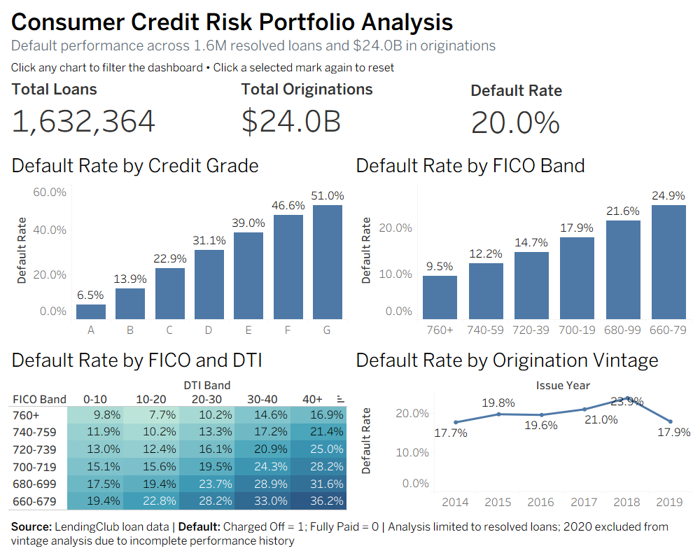

# Consumer Credit Risk Portfolio Analysis

An end-to-end consumer credit risk analytics project analyzing more than **1.6 million resolved LendingClub loans** and approximately **$24 billion in originations**.

The project combines **Python, SQL, credit-risk segmentation, probability-of-default modeling, and Tableau** to identify historical default patterns and translate them into practical portfolio risk insights.

## Business Problem

Consumer lenders must balance growth with credit quality. This project evaluates historical loan performance to answer several key risk-management questions:

- Which borrower characteristics are associated with higher default risk?
- How effectively do credit grade, FICO score, and debt-to-income ratio differentiate risk?
- Can borrower characteristics be used to estimate probability of default?
- How has credit performance changed across origination vintages?
- How can these findings support underwriting and portfolio monitoring?

## Dataset

The analysis uses LendingClub consumer loan data covering 2014–2020, with resolved loan outcomes used for modeling and 2020 excluded from vintage analysis due to incomplete performance history.

The original dataset contained approximately **2.9 million loans and 142 variables**. The analysis reduced the dataset to the borrower, loan, and credit-risk variables needed for analysis.

For modeling, only loans with resolved outcomes were retained:

- **Fully Paid = 0**
- **Charged Off = 1**

The final modeling dataset contains approximately **1.63 million resolved loans**.

> The raw LendingClub dataset is not included in this repository because of its size.

## Portfolio Overview

- **Resolved loans:** 1,632,364
- **Total originations:** approximately $24.0 billion
- **Observed default rate:** approximately 20.0%
- **Average FICO score:** approximately 699
- **Average interest rate:** approximately 13.1%

## Tableau Dashboard

The dashboard allows users to interactively segment portfolio performance by:

- Credit grade
- FICO band
- Debt-to-income (DTI) band
- Origination vintage

Selecting a segment dynamically updates portfolio loan count, originations, default rate, and the remaining risk views.

## Key Findings

### 1. Credit Grade Strongly Differentiates Default Risk

Observed default rates increased consistently as credit grade deteriorated:

- Grade A: **6.5%**
- Grade B: **13.9%**
- Grade C: **22.9%**
- Grade D: **31.1%**
- Grade E: **39.0%**
- Grade F: **46.6%**
- Grade G: **51.0%**

Grade G borrowers experienced roughly eight times the default rate of Grade A borrowers.

### 2. Lower FICO Scores Are Associated With Higher Default Rates

Observed default rates increased as borrower FICO declined:

- 760+: **9.5%**
- 740–759: **12.2%**
- 720–739: **14.7%**
- 700–719: **17.9%**
- 680–699: **21.6%**
- 660–679: **24.9%**

FICO provides meaningful risk differentiation, but borrower risk is not fully explained by FICO alone.

### 3. DTI Adds Risk Information Within FICO Segments

The FICO × DTI analysis shows that borrowers with similar FICO scores can experience materially different default rates depending on debt burden.

For example, within the **660–679 FICO band**, observed default rates increased from approximately **19.4%** for borrowers with DTI below 10 to approximately **36.2%** for borrowers with DTI above 40.

This suggests that combining credit score and affordability measures produces more useful risk segmentation than relying on either measure independently.

### 4. Default Performance Varies Across Origination Vintages

Observed default rates varied across origination years:

- 2014: **17.7%**
- 2015: **19.8%**
- 2016: **19.6%**
- 2017: **21.0%**
- 2018: **23.9%**
- 2019: **17.9%**

Vintage analysis can help identify changes in portfolio composition, underwriting standards, or macroeconomic conditions that warrant further investigation.

## Probability of Default Modeling

Two logistic regression models were developed to estimate borrower-level probability of default.

### Model 1

Features:

- FICO score
- Debt-to-income ratio
- Annual income
- Loan amount

Test performance:

- **ROC-AUC: ~0.63**
- **Accuracy: ~79.9%**

### Model 2

Additional features:

- Interest rate
- Credit grade

Test performance:

- **ROC-AUC: ~0.69**
- **Accuracy: ~79.9%**

Adding pricing and credit-quality information materially improved the model's ability to rank borrowers by default risk.

Risk-decile analysis also showed that the model meaningfully separated lower-risk and higher-risk borrowers.

## SQL Analysis

SQL was used to recreate several core portfolio analyses and demonstrate how borrower risk can be segmented directly from loan-level data.

The SQL analysis includes:

- Portfolio-level KPIs
- Default rate by credit grade
- FICO band creation using `CASE WHEN`
- FICO × DTI segmentation
- CTE-based risk transformation and aggregation

See:

`sql/credit_risk_analysis.sql`

## Business Recommendations

1. **Use multi-factor underwriting rather than relying on FICO alone.**  
   DTI provides meaningful incremental risk differentiation within FICO bands.

2. **Apply additional scrutiny to higher-risk credit grades.**  
   Grades D–G demonstrate materially higher historical default rates and may warrant stronger verification, tighter exposure limits, or enhanced monitoring.

3. **Use probability-of-default scores for risk ranking.**  
   Model scores can help prioritize accounts or applications for additional review and support portfolio-level segmentation.

4. **Monitor vintage performance.**  
   Changes in default rates across origination years should be investigated for shifts in borrower mix, underwriting strategy, or external conditions.

5. **Evaluate risk-adjusted economics before changing approval policy.**  
   Higher default rates do not necessarily imply that a borrower segment is unprofitable. Pricing, recoveries, funding costs, and loss severity should also be considered.

## Limitations

- The analysis is based on historical LendingClub data and may not represent current lending conditions.
- Observed relationships are associative and should not be interpreted as causal.
- The modeling exercise focuses on probability of default and does not incorporate loss given default, exposure at default, recoveries, funding costs, or profitability.
- Interest rate and credit grade contain lender risk-assessment information and therefore improve predictive performance partly by incorporating information already used in LendingClub's underwriting process.
- 2020 was excluded from the vintage analysis because the available observation period does not provide comparable performance history.

## Tools

- Python
- pandas
- NumPy
- scikit-learn
- Matplotlib
- SQL
- Tableau
- Git / GitHub

## Repository Structure

    consumer-credit-risk-strategy/
    ├── README.md
    ├── .gitignore
    ├── notebooks/
    │   └── credit risk analysis notebook
    ├── sql/
    │   └── credit_risk_analysis.sql
    └── dashboard/
        ├── README.md
        └── credit_risk_dashboard.png

## Skills Demonstrated

Credit risk analysis • Portfolio analytics • SQL data analysis • Probability of default modeling • Logistic regression • Risk segmentation • Model evaluation • Data visualization • Business strategy • Python • Tableau
